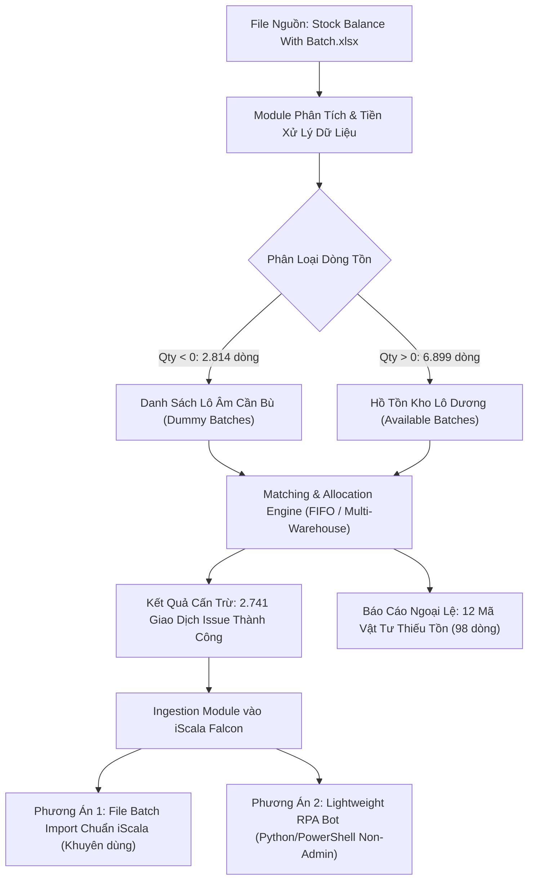

# Kế Hoạch Tự Động Hóa Xử Lý Cấn Trừ Lô Âm (Negative Batch Issue) Trên iScala Falcon

## Goal Description
Xây dựng quy trình tự động hóa hoàn chỉnh để:
1. **Phân tích và đối soát file nguồn** `Stock Balance With Batch.xlsx` chứa 9.713 dòng dữ liệu tồn kho theo lô.
2. **Thực hiện thuật toán cấn trừ (Offset/Issue)**: Tự động lấy các lô (batch) dương tương ứng của từng mã vật tư (Stock Code) theo nguyên tắc FIFO (First-In, First-Out) / ưu tiên kho để bù đắp và triệt tiêu toàn bộ các lô âm tạm thời (`******XXXXXX`).
3. **Đưa ra giải pháp kỹ thuật khả thi trên Server iScala (Falcon Environment)** trong điều kiện ràng buộc: **Không có Microsoft Excel** và **Không có quyền Administrator**.

---

## Phân Tích & Đánh Giá Môi Trường Server Falcon (Không Excel, Không Admin)

### 1. Đánh giá Khách quan (Objective Assessment)

| Yếu tố môi trường | Đặc điểm thực tế | Tác động & Rủi ro | Giải pháp kỹ thuật tương ứng |
| :--- | :--- | :--- | :--- |
| **Không có Microsoft Excel** | Server không cài đặt bộ Microsoft Office. | Không thể chạy Excel VBA Macro trực tiếp trên máy chủ. | Dùng **Python (thư viện `pandas`, `openpyxl`)** hoặc **PowerShell** để đọc/ghi trực tiếp định dạng nhị phân/XML của file `.xlsx` mà **hoàn toàn không phụ thuộc** vào ứng dụng Excel. |
| **Không có quyền Administrator** | Người dùng đăng nhập tài khoản User thông thường, không can thiệp được System Registry, không chạy installer (`.msi`, `setup.exe`). | Không thể cài đặt các phần mềm RPA cồng kềnh (UiPath, Power Automate Enterprise) hoặc driver hệ thống. | Sử dụng **Python Embeddable / Portable** (chạy trực tiếp trong User directory không cần install) hoặc **PowerShell Script sẵn có** của Windows. |
| **Giao diện Falcon / iScala** | Falcon là giao diện Web / Client của Epicor iScala để quản lý nghiệp vụ ERP. | Nếu can thiệp trực tiếp vào database SQL thì vi phạm toàn vẹn dữ liệu kế toán và logic ERP. | Đi qua các kênh tiêu chuẩn của iScala:  1) **Chức năng Import Lô / Batch Transaction của iScala** 2) **Giao diện người dùng Falcon thông qua script tự động (RPA không cần admin)**. |

### 2. Đánh giá Chủ quan (Subjective Assessment & Lựa Chọn Tối Ưu)

* **Nhận định**: 
  - Việc không có Excel **không hề cản trở** tự động hóa vì việc xử lý logic trên file Excel thực chất là xử lý dữ liệu (Data Processing), các ngôn ngữ như Python xử lý nhanh hơn VBA gấp 10-50 lần đối với tệp gần 10.000 dòng.
  - Việc không có Admin được giải quyết triệt để bằng **mô hình Portable Application (chạy không cần cài đặt)**.
* **Đề xuất mô hình triển khai (2 Phương án)**:
  - **Phương Án A (Tối ưu nhất - Hybrid Data Ingestion)**: 
    - Chạy script thuật toán khớp dữ liệu -> Tạo ra file `.csv` hoặc file định dạng Import của iScala Falcon.
    - Người dùng chỉ cần vào chức năng Import trên Falcon để nạp 1 lần hàng nghìn giao dịch trong vài giây.
  - **Phương Án B (Automation Bot chạy User-Space)**:
    - Sử dụng script Python Portable (với thư viện nhẹ `pyautogui` / `pywinauto` hoặc `playwright`) để tự động hóa thao tác nhập liệu trên giao diện Falcon mà không cần quyền Admin.

---

## Chi Tiết Dữ Liệu File Nguồn `Stock Balance With Batch.xlsx`

Qua phân tích chi tiết tệp dữ liệu:
- **Tổng số dòng**: 9.713 dòng.
- **Dòng tồn dương (Qty > 0)**: 6.899 dòng (các lô thật như `999900002505`, `900002992699`,...).
- **Dòng tồn âm (Qty < 0)**: 2.814 dòng (các lô tạm `******000263`, `******000279`,...).
- **Kho phát sinh âm**: Tập trung chủ yếu ở **Kho 50** (883 dòng âm) và **Kho 62** (1.931 dòng âm).
- **Kho có tồn dương lớn**: Kho 61 (3.363 dòng), Kho 62 (880 dòng dương), Kho 60, Kho 01.
- **Số lượng mã vật tư (Stock Code) bị âm**: 109 mã.
  - **97 mã**: Đủ tồn dương để cấn trừ hoàn toàn.
  - **12 mã**: Không đủ hoặc chưa có tồn dương trong file (tổng thiếu 98 dòng), gồm các mã: `3405710001`, `3434210001`, `3434220001`, `3437070201`, `3437150201`, `3443650201`, `3457800001`, `3462260001`, `3464670001`, `3465960101`, `3888130001`, `7100070051PA`.

---

## Thuật Toán Cấn Trừ & Khớp Lô (Matching & Offset Logic)

1. **Nhóm theo `Stock Code`**: Mỗi mã hàng xử lý độc lập.
2. **Sắp xếp dòng âm**: Theo `CREATEDATE` tăng dần (phát sinh trước xử lý trước) -> `Warehouse` -> `BATCH`.
3. **Sắp xếp dòng dương**: Theo nguyên tắc FIFO (`CREATEDATE` tăng dần) để xuất các lô nhập sớm nhất trước.
4. **Vòng lặp khớp (Allocation Loop)**:
   - Với mỗi dòng âm cần bù $Q_{neg}$:
     - Lấy lô dương khả dụng đầu tiên có $Q_{avail}$.
     - Số lượng cấn trừ: $Q_{offset} = \min(Q_{neg}, Q_{avail})$.
     - Giảm $Q_{neg} = Q_{neg} - Q_{offset}$ và $Q_{avail} = Q_{avail} - Q_{offset}$.
     - Nếu $Q_{avail} = 0$, chuyển sang lô dương tiếp theo.
     - Lặp lại cho đến khi $Q_{neg} = 0$ hoặc hết lô dương khả dụng.
5. **Xử lý tách lô (Splitting)**: Tự động phân bổ 1 dòng âm qua nhiều lô dương (hoặc 1 lô dương cho nhiều dòng âm) chính xác đến từng đơn vị.

---

## User Review Required

> [!IMPORTANT]
> **Quy tắc ưu tiên kho (Warehouse Priority)**:
> 1. Khi cấn trừ, anh có muốn **ưu tiên lấy lô dương cùng kho** trước (ví dụ: dòng âm ở Kho 62 thì lấy lô dương ở Kho 62 trước, nếu hết mới lấy từ Kho 61 chuyển sang)? 
> 2. Hay áp dụng thuần túy **FIFO theo Ngày tạo (CREATEDATE)** trên toàn bộ các kho bất kể vị trí kho?

> [!NOTE]
> **12 Mã vật tư không đủ tồn**:
> Hệ thống sẽ tự động xuất danh sách 12 mã này ra một báo cáo riêng (Shortage / Exception Report) để người vận hành kiểm tra lại nhập kho thực tế hoặc phiếu GRN chưa hoàn tất.

---

## Open Questions

> [!QUESTION]
> **1. Phương thức giao tiếp với iScala Falcon trên Server**:
> Trong môi trường Falcon của anh, hệ thống tiếp nhận giao dịch điều chỉnh/xuất kho bằng cách nào?
> - **Cách 1**: Import file dữ liệu (Excel/CSV/Text file theo mẫu định dạng của iScala).
> - **Cách 2**: Mở màn hình thao tác Falcon (Web UI hoặc Windows Client) và gõ từng phiếu.
> 
> *Nếu có mẫu file Import hoặc tên màn hình chức năng cụ thể trên Falcon, em sẽ thiết kế định dạng xuất ra chuẩn 100% khớp với hệ thống của anh.*

---

## Proposed Changes

Chúng ta sẽ xây dựng bộ công cụ tự động hóa dạng **Portable / Script đa nền tảng** đặt trong thư mục dự án:

### Component: Core Matching Engine & Exporter

#### [NEW] `stock_batch_matcher.py`
Script xử lý logic nghiệp vụ chính:
- Đọc file Excel `Stock Balance With Batch.xlsx` (không cần cài Microsoft Excel).
- Thực thi thuật toán FIFO / Multi-Warehouse Allocation.
- Xuất ra 3 file kết quả:
  1. `Issue_Transaction_List.xlsx` / `.csv`: Chi tiết từng dòng cấn trừ (Mã vật tư, Lô âm, Lô dương nguồn, Kho nguồn, Kho đích, Số lượng bù).
  2. `Shortage_Exception_Report.xlsx`: Danh sách các lô âm không đủ hàng bù kèm nguyên nhân.
  3. `iScala_Import_Ready.csv` / `.txt`: Tệp dữ liệu sẵn sàng import vào iScala Falcon.

#### [NEW] `run_automation.bat` / `run_automation.ps1`
File khởi chạy nhanh (1-Click Execution) dành cho môi trường máy chủ:
- Chạy trực tiếp bằng Python Portable hoặc PowerShell.
- Không yêu cầu cài đặt phần mềm, không đòi hỏi quyền Admin.

#### [NEW] `falcon_gui_automator.py` (Tùy chọn cho Phương án RPA)
Script tự động hóa giao diện Falcon (nếu anh chọn phương án điền tự động qua UI).

---

## Verification Plan

### Automated Tests
1. **Kiểm tra tính bảo toàn số lượng (Quantity Conservation Test)**:
   - Tổng số lượng cấn trừ được tạo ra = Tổng số lượng âm của 97 mã vật tư đủ tồn + Phần đã bù của các mã thiếu tồn.
   - Tồn kho của các lô dương sau khi trừ không bao giờ bị âm.
2. **Kiểm tra tính chính xác FIFO**:
   - Đảm bảo các lô dương có `CREATEDATE` cũ hơn luôn được xuất trước các lô mới hơn.

### Manual Verification
1. Mở file kết quả `Issue_Transaction_List.xlsx` và kiểm tra đối soát chéo một số mã vật tư tiêu biểu (ví dụ `3400250001`, `3405010201`).
2. Kiểm tra file `Shortage_Exception_Report.xlsx` để xác nhận 12 mã vật tư thiếu tồn kho.
