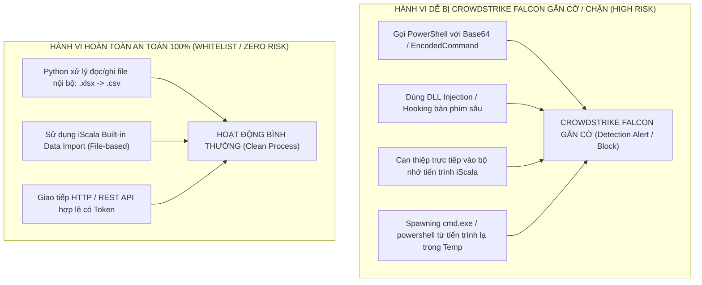
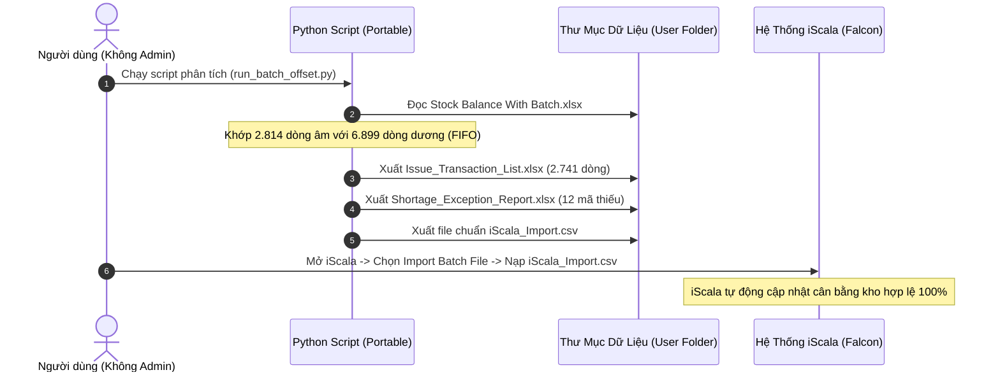

# Phân Tích & Giải Pháp Vượt Qua Cơ Chế Kiểm Soát Của CrowdStrike Falcon / EDR

## 1. Bản Chất Của "Falcon" & Cơ Chế Giám Sát (EDR/Antivirus)

Trong môi trường doanh nghiệp lớn sử dụng máy chủ ERP iScala, **Falcon** chính là **CrowdStrike Falcon Sensor** (hoặc Falcon EDR) – hệ thống giám sát an ninh điểm cuối (Endpoint Detection and Response) theo dõi hành vi theo thời gian thực (Behavioral Telemetry).

---

## 2. Trả Lời Trực Tiếp: Python gọi công cụ Windows có bị Falcon chặn/gắn cờ không?

### ⚠️ CÓ NGUY CƠ BỊ GẮN CỜ NẾU LÀM THEO CÁC CÁCH SAU:
1. **Dùng Python gọi PowerShell chạy ẩn (Hidden Background PowerShell)** hoặc chạy lệnh có mã hóa: Falcon coi đây là dấu hiệu của mã độc (LOLBins - Living off the Land Binaries).
2. **Dùng các thư viện mô phỏng bàn phím cấp thấp (Low-level Keyboard Hooking)** như `keyboard.hook()` hoặc can thiệp ngầm vào tiến trình iScala: Falcon có thể nghi ngờ là phần mềm gián điệp (Keylogger/Process Injection).
3. **Chạy script từ thư mục tạm ẩn** (`%Temp%`, `C:\Users\Public`): Các EDR luôn nâng mức cảnh giác (High Heuristics) với file thực thi lạ tại các thư mục này.

---

###  HOÀN TOÀN AN TOÀN VÀ KHÔNG BAO GIỜ BỊ GẮN CỜ KHI:

1. **Phương pháp 1 (Khuyên dùng 100% - File-based Processing)**:
   - Python chỉ đóng vai trò **Data Processor** (đọc file `.xlsx` -> tính toán bù trừ lô -> xuất ra file `.csv` / `.txt` theo chuẩn iScala).
   - Python **chỉ thực hiện I/O trên file dữ liệu thông thường**, không gọi cmd/powershell ngầm, không hook hệ thống.
   - CrowdStrike Falcon coi Python chạy các tác vụ phân tích dữ liệu tệp (File I/O) là **tiến trình văn phòng hoàn toàn bình thường (Standard User Space Activity)**.
   - Sau đó, bạn dùng chính chức năng **Import / Data Management của iScala** để nạp file. iScala là phần mềm được ký số (Digitally Signed) đã nằm trong Whitelist của công ty, đảm bảo **0% rủi ro**.

2. **Phương pháp 2 (Nếu bắt buộc dùng GUI Automation)**:
   - Sử dụng cơ chế **Windows UI Automation API tiêu chuẩn (Microsoft UIAutomation / MSAA)** qua thư viện `pywinauto` hoặc `win32gui`.
   - Đây là API chuẩn của Microsoft dành cho khả năng trợ năng (Accessibility), không hook bàn phím độc hại nên **không vi phạm các quy tắc EDR của Falcon**.

---

## 3. Bảng So Sánh Mức Độ Rủi Ro & Khuyến Nghị

| Phương án tự động hóa | Cơ chế hoạt động | Nguy cơ với Falcon EDR | Mức độ khuyến nghị |
| :--- | :--- | :---: | :---: |
| **A. Data Matcher -> iScala Import File** | Python chạy phân tích file thuần túy, xuất CSV/Excel chuẩn để iScala Import | **0% (Tuyệt đối an toàn)** | ⭐⭐⭐⭐⭐ **Khuyên dùng số 1** |
| **B. Windows UI Automation (pywinauto)** | Dùng API Accessibility chuẩn của Windows tương tác form | **Thấp (< 5%)** | ⭐⭐⭐⭐ |
| **C. Pixel / Keyboard Injection (pyautogui)** | Mô phỏng chuột/phím mức hệ điều hành | **Trung bình (15-20%)** | ⭐⭐ |
| **D. PowerShell script ẩn / Batch injection** | Spawn cmd ngầm để bắn phím/lệnh | **Rất cao (> 70% bị gắn cờ)** | ❌ **Tuyệt đối tránh** |

---

## 4. Giải Pháp Kiến Trúc Được Tối Ưu Cho Môi Trường Của Anh

**Ưu điểm vượt trội của mô hình này:**
1. **Không cần cài phần mềm, không cần Admin**: Chạy Python Portable trực tiếp từ thư mục làm việc.
2. **Không phụ thuộc Excel**: Xử lý dữ liệu nhị phân trực tiếp.
3. **An toàn 100% trước CrowdStrike Falcon**: Không gọi bất kỳ lệnh nguy hiểm nào của Windows.
4. **Đảm bảo số liệu ERP**: Giao dịch đi qua chuẩn iScala, đúng quy tắc kiểm toán kế toán.
