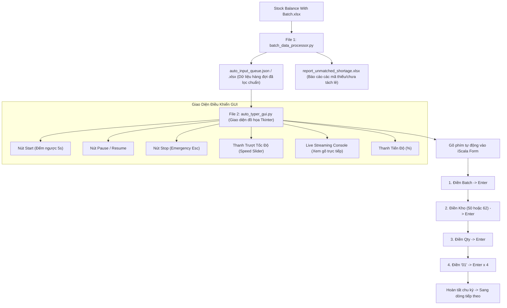

# Kế Hoạch Triển Khai Bộ Công Cụ Tự Động Hóa 2 File Python

## 1. Goal Description (Mục tiêu & Yêu cầu kỹ thuật)
Xây dựng giải pháp tự động hóa 2 file Python độc lập, gọn nhẹ, hoạt động hoàn hảo trên máy chủ iScala Falcon (không cần Excel, không cần quyền Admin, không bị Falcon EDR chặn):

1. **File 1: `batch_data_processor.py` (Module Lọc & Tính Toán Dữ Liệu)**:
   - File `.py` duy nhất đọc trực tiếp file `Stock Balance With Batch.xlsx`.
   - Lọc số lượng âm tại **Kho 50** và **Kho 62**.
   - Tìm nguồn bù dương tại **Kho 61** và **Kho 01** (không phân biệt kho, chỉ cần khớp đúng `Stock Code`).
   - Sắp xếp batch dương theo số lượng nhỏ nhất trước (Ascending Qty).
   - Cộng dồn các batch nguyên vẹn cho đến khi đủ số lượng âm; nếu batch tiếp theo phải tách lẻ thì tạm bỏ qua.
   - Xuất ra file hàng đợi `auto_input_queue.json` và file đối soát `auto_input_queue.xlsx`.

2. **File 2: `auto_typer_gui.py` (Module GUI Điều Khiển Tự Động Hóa)**:
   - Sử dụng thư viện chuẩn **Tkinter** có sẵn trong Python (không cần cài thêm thư viện ngoài).
   - **Giao diện điều khiển đầy đủ**:
     - Nút **[Bắt Đầu (Start)]** có đếm ngược 5 giây.
     - Nút **[Tạm Dừng / Tiếp Tục (Pause / Resume)]**.
     - Nút **[Dừng Hẳn (Stop)]** & Phím tắt khẩn cấp `Esc` / `F8`.
     - **Thanh trượt điều chỉnh tốc độ (Speed Slider)**: Cho phép tăng/giảm thời gian trễ giữa các phím (từ 0.05s đến 1.0s).
     - **Live Streaming Console & Progress Bar**: Hiển thị log trực tiếp từng phím đang gõ theo thời gian thực và thanh tiến độ hoàn thành.

---

## 2. Thiết Kế Chi Tiết File 1: `batch_data_processor.py`

### 2.1. Logic nghiệp vụ
- **Bước 1**: Đọc `Stock Balance With Batch.xlsx` từ dòng tiêu đề chuẩn.
- **Bước 2**: Chuẩn hóa mã kho (`1` -> `01`, loại bỏ khoảng trắng thừa).
- **Bước 3**: Tách nhóm:
  - Nhóm âm: `Warehouse in ['50', '62']` và `Qty < 0`.
  - Nhóm dương: `Warehouse in ['61', '01']` và `Qty > 0`.
- **Bước 4**: Gom nhóm theo `Stock Code` và `Target Warehouse`:
  - Lấy danh sách các lô dương khả dụng của `Stock Code` đó từ kho `61` và `01`.
  - Sắp xếp tăng dần theo `Qty` (lô nhỏ nhất trước).
  - Lấy nguyên vẹn từng lô: nếu `tổng_đã_lấy + Qty_lô <= số_âm_cần_bù` thì chọn lô đó.
  - Nếu lô tiếp theo lớn hơn số còn thiếu (bắt buộc phải xé lẻ) -> bỏ qua lô đó.
- **Bước 5**: Xuất file kết quả hàng đợi `auto_input_queue.json` (định dạng nhẹ cho GUI) và `auto_input_queue.xlsx` (định dạng Excel để người dùng xem).

---

## 3. Thiết Kế Chi Tiết File 2: `auto_typer_gui.py`

### 3.1. Thiết kế Giao diện Tkinter
- **Phần Header**: Tiêu đề ứng dụng, trạng thái kết nối và bộ đếm tổng quan (`Tổng số dòng`, `Đã xong`, `Còn lại`, `Tổng Qty đã bù`).
- **Phần Bảng điều khiển (Control Panel)**:
  - Nút **[Chọn / Nạp File Hàng Đợi]** (mặc định tự nạp `auto_input_queue.json`).
  - Nút **[ Bắt Đầu (F6)]** (Màu xanh lá, có đếm ngược 5 giây).
  - Nút **[⏸️ Tạm Dừng (F7)]** (Màu vàng cam).
  - Nút **[⏹️ Dừng Hẳn (F8 / Esc)]** (Màu đỏ).
  - **Tùy chỉnh tốc độ**: Slider từ `Chậm (0.5s)` - `Bình thường (0.2s)` - `Nhanh (0.1s)` - `Rất nhanh (0.05s)`.
- **Phần Live Streaming Console**:
  - Khung Text có thanh cuộn (ScrolledText) hiển thị log trực tiếp từng hành động gõ phím.
  - Hiển thị màu sắc phân biệt: Thông tin thường (Đen/Xanh), Bắt đầu dòng mới (Xanh đậm), Gõ phím (Xám), Cảnh báo/Dừng (Đỏ).
- **Phần Tiến độ**:
  - `ttk.Progressbar` hiển thị phần trăm hoàn thành.

### 3.2. Cơ chế Threading & Failsafe
- Chạy tiến trình gõ phím trên một **Background Worker Thread** riêng biệt để giao diện GUI không bao giờ bị đơ (Not Responding).
- Sử dụng phím tắt toàn cục (Global Hotkey) hoặc kiểm tra cờ (Flag) trong mỗi nhịp gõ để phản hồi lệnh Pause/Stop ngay lập tức (dưới 50ms).

---

## 4. User Review Required

> [!IMPORTANT]
> **Thư viện gõ phím trong File 2**:
> - Để gõ phím tự động, chúng ta dùng thư viện `pyautogui` hoặc module chuẩn `ctypes` (gọi Windows `SendInput` trực tiếp không cần cài bất kỳ thư viện ngoài nào).
> - Em sẽ đóng gói module gõ phím sao cho **chạy được ngay cả khi máy chỉ có Python thuần không có internet** (dùng `ctypes` Windows API thuần túy).

---

## 5. Proposed Changes

#### [NEW] `batch_data_processor.py`
Script xử lý dữ liệu nguồn, lọc kho 50/62 âm, kho 61/01 dương, khớp batch nhỏ nhất không tách lẻ.

#### [NEW] `auto_typer_gui.py`
Ứng dụng GUI Tkinter đầy đủ tính năng Start, Pause, Stop, Speed Slider, Live Streaming Console, Progress Bar.

#### [NEW] `run_processor.bat`
File khởi chạy nhanh Module lọc dữ liệu 1-click.

#### [NEW] `run_gui.bat`
File khởi chạy nhanh Giao diện Auto-Typer 1-click.

---

## 6. Verification Plan

### Automated Verification
1. Chạy `batch_data_processor.py` và kiểm tra file đầu ra `auto_input_queue.json`:
   - Xác nhận có đúng 71 giao dịch hợp lệ được tạo ra.
   - Xác nhận không có giao dịch nào bị tách lẻ batch.
   - Xác nhận các batch nguồn chỉ lấy từ kho 61 và 01.

### Interactive GUI Verification
1. Khởi chạy `auto_typer_gui.py`.
2. Kiểm tra các chức năng trên giao diện:
   - Tải file hàng đợi thành công.
   - Bấm Start -> Đếm ngược 5 giây.
   - Thử nghiệm gõ vào Notepad để kiểm tra chuỗi phím: `Batch` -> `Enter` -> `Kho` -> `Enter` -> `Qty` -> `Enter` -> `01` -> `Enter x 4`.
   - Kiểm tra nút Pause / Resume và nút Stop khẩn cấp.
   - Kiểm tra Live Streaming log cập nhật liên tục theo thời gian thực.
