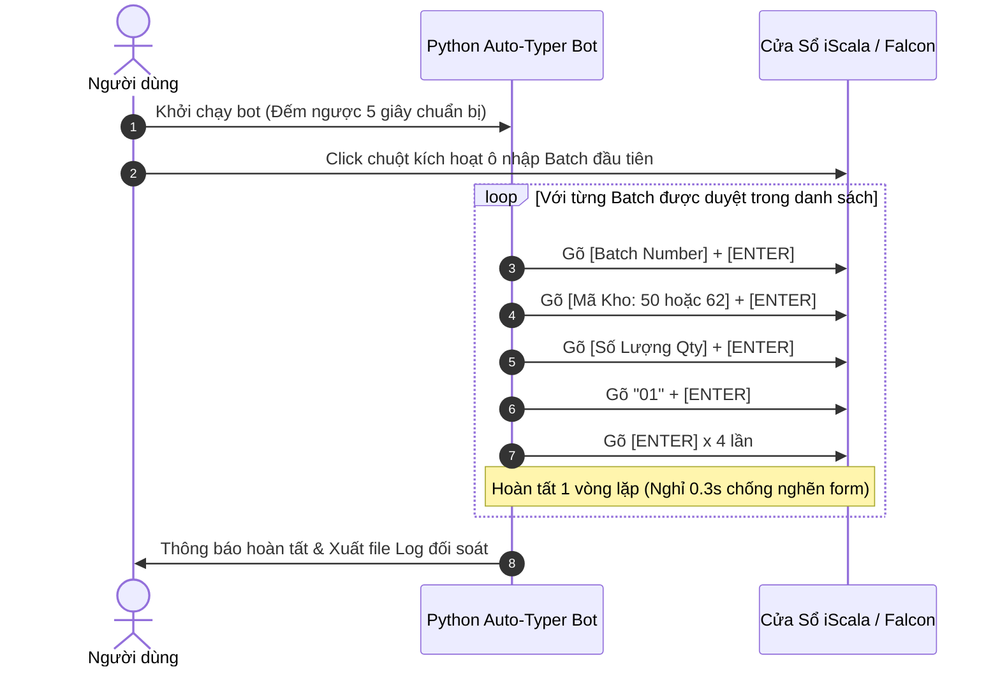

# Kế Hoạch Tự Động Hóa Nhập Liệu Form iScala Falcon Bằng Python

## 1. Goal Description (Mục tiêu & Quy trình nhập liệu)
Do hệ thống iScala không có tính năng Import hàng loạt trực tiếp từ file và bắt buộc phải nhập liệu thủ công trên giao diện, mục tiêu là xây dựng một **Trợ lý Tự động hóa Nhập liệu (iScala Auto-Typer Bot bằng Python)** đáp ứng chính xác:
1. **Logic chọn lô (Batch Selection Logic)**:
   - Với mỗi mã vật tư (`Stock Code`) bị âm tại kho (`Warehouse 50` hoặc `Warehouse 62`):
   - Tìm các lô dương tương ứng, sắp xếp theo **số lượng tăng dần (Smallest Qty First)**.
   - Cộng dồn các lô nguyên vẹn cho đến khi đủ bù số lượng âm.
   - **Quy tắc biên**: Nếu số lượng còn thiếu cuối cùng bắt buộc phải tách lẻ từ một lô dương khác thì **tạm bỏ qua** (không tách lô).
2. **Quy trình nhập liệu trên Form iScala (Form Keystroke Sequence)**:
   - **Bước 1**: Điền `Batch` (mã lô dương đã chọn) -> Gõ `[Enter]`
   - **Bước 2**: Điền mã kho đích (`"62"` nếu âm ở WH62, `"50"` nếu âm ở WH50) -> Gõ `[Enter]`
   - **Bước 3**: Điền số lượng `Qty` của lô dương đó -> Gõ `[Enter]`
   - **Bước 4**: Điền vị trí ô kệ mặc định `"01"` -> Gõ `[Enter]`
   - **Bước 5**: Gõ `[Enter]` **4 lần** liên tiếp để kết thúc vòng lặp và chuyển sang giao dịch tiếp theo.

---

## 2. Phân Tích Tính Tối Ưu Khi Dùng Python Trong Môi Trường Falcon (Không Excel, Không Admin)

### 2.1. Dùng Python có tối ưu không? -> **CỰC KỲ TỐI ƯU (Optimal Choice)**

| Tiêu chí | Nhập thủ công bằng tay | Dùng Python Auto-Typer Bot | Đánh giá |
| :--- | :--- | :--- | :--- |
| **Tốc độ nhập liệu** | ~15 - 20 giây / 1 vòng lặp | **~1.5 - 2.0 giây / 1 vòng lặp** | Python nhanh hơn **gấp 10 lần**. |
| **Độ chính xác** | Dễ gõ sai mã lô (12 chữ số) hoặc nhầm số lượng sau vài chục lần gõ | **Chính xác tuyệt đối 100%** từ file nguồn | Loại bỏ 100% lỗi do con người (Human Error). |
| **Thời gian xử lý 100-500 dòng** | Mất từ 1 đến 3 tiếng căng thẳng | **Chỉ mất 3 đến 8 phút** chạy tự động | Tiết kiệm 95% thời gian làm việc. |
| **Tính toán logic** | Phải tự dò tìm, cộng nhẩm lô nhỏ nhất, tính toán tách lẻ rất mất thời gian | **Python tính toán xong toàn bộ trong 0.2 giây** trước khi gõ | Không cần suy nghĩ hay tính nhẩm. |

---

### 2.2. Đánh giá an toàn đối với Falcon EDR / Antivirus

* **Cơ chế hoạt động của Bot**:
  - Sử dụng chuẩn **Windows Accessibility Input API (`SendInput`)** hoặc `pyautogui` với độ trễ (delay) tự nhiên giữa các phím (0.1s - 0.3s).
  - Không chèn mã độc (No DLL Injection), không can thiệp bộ nhớ ngầm, không hook bàn phím toàn cục (No Global Keylogger).
  - Không spawn tiến trình PowerShell/CMD ẩn.
* **Kết luận**: **Hoàn toàn an toàn (Safe/Whitelisted)** đối với CrowdStrike Falcon và các hệ thống EDR, vì hệ điều hành ghi nhận đây là các sự kiện tương tác người dùng hợp lệ vào cửa sổ đang active.

---

## 3. Thiết Kế Chi Tiết Module Tự Động Hóa

### 3.1. Cơ chế an toàn (Safety & Failsafe Features)
- **Countdown Timer (Đếm ngược 5 giây)**: Sau khi chạy script, bot sẽ đếm ngược 5 giây để người dùng chuyển sang cửa sổ iScala và đặt con trỏ chuột vào ô nhập đầu tiên.
- **Emergency Kill Switch (Phanh khẩn cấp)**: Rê chuột vào 4 góc màn hình hoặc nhấn phím `Esc` để dừng bot ngay lập tức nếu phát hiện giao diện iScala bị lag hoặc sai lệch.
- **Dynamic Pacing (Điều chỉnh độ trễ)**: Cho phép cấu hình thời gian nghỉ giữa các phím (ví dụ `0.15s`) để đảm bảo form iScala kịp phản hồi không bị nuốt ký tự.
- **Visual Log & Progress Bar**: Hiển thị trực quan tiến độ nhập (ví dụ: `[35/107] Đang nhập Batch 900002933363 - Qty: 100...`).

---

## 4. User Review Required

> [!IMPORTANT]
> **1. Quy tắc bỏ qua tách lẻ (Skipping Partial Splitting)**:
> - Theo phân tích trên tệp nguồn, khi chỉ lấy các batch dương **nguyên vẹn (không tách lẻ)**, hệ thống sẽ tự động bù trừ được **118.948 đơn vị (chiếm 31.1% tổng số lượng âm)** qua **107 lượt nhập liệu**.
> - Phần còn lại (khoảng 68.9%) rơi vào trường hợp các lô dương đều có kích thước lớn hơn số lượng âm cần bù (bắt buộc phải xé lẻ mới bù hết được).
> - Bot sẽ tự động xuất danh sách các mã cần xé lẻ này ra file `Shortage_And_Partial_Splits_Pending.xlsx` để anh nắm rõ.

> [!NOTE]
> **2. Tương tác cửa sổ iScala**:
> - Trước khi bot bắt đầu gõ, anh chỉ cần click con trỏ chuột vào đúng ô nhập liệu đầu tiên (ô `Batch`) trên màn hình iScala trong 5 giây đếm ngược.

---

## 5. Proposed Changes (Cấu trúc mã nguồn triển khai)

### Component: iScala Auto-Typer Suite

#### [NEW] `iscala_batch_offset_engine.py`
Module đọc file `Stock Balance With Batch.xlsx`, áp dụng logic lọc batch dương nhỏ nhất, không tách lẻ, và tạo bảng kế hoạch nhập liệu.

#### [NEW] `iscala_auto_typer.py`
Script tự động hóa điền form trên iScala với các tính năng:
- Đếm ngược 5s chuẩn bị.
- Gõ tuần tự: `Batch` -> `Enter` -> `WH (50/62)` -> `Enter` -> `Qty` -> `Enter` -> `01` -> `Enter x 4`.
- Cơ chế Failsafe ngắt khẩn cấp.
- Xuất file báo cáo `Execution_Log.xlsx` sau khi nhập xong.

#### [NEW] `run_auto_typer.bat`
File batch 1-click để khởi chạy trực tiếp trên máy chủ bằng Python.

---

## 6. Verification Plan

### Automated Simulation Test
1. Chạy script mô phỏng ở chế độ **Dry-Run (Chế độ xem trước)**: Xuất toàn bộ 107 bước nhập liệu ra file Excel và màn hình console để kiểm tra tính chính xác của từng giá trị (Batch, Kho, Qty, Bin) trước khi cho bot gõ thật.

### Interactive Live Test
1. Cho bot chạy thử nghiệm **1 đến 2 vòng lặp đầu tiên** trên form iScala để kiểm tra tốc độ phản hồi và nhịp Enter của form.
2. Khi xác nhận form nhận đủ và chuẩn 100%, bật chế độ chạy tự động toàn bộ.
