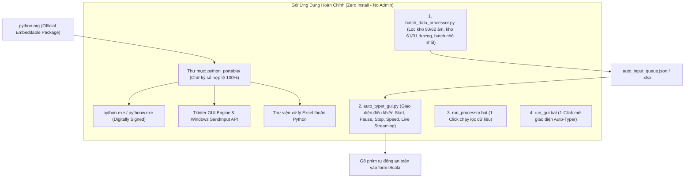

# Kế Hoạch Đóng Gói Bộ Công Cụ Python Portable Có Chữ Ký Số Hợp Chuẩn Falcon EDR

## 1. Goal Description (Mục tiêu gói Portable)
Do máy chủ iScala hiện tại **chưa có Python**, **không có quyền Administrator** để cài đặt phần mềm, và **có CrowdStrike Falcon EDR giám sát**:
- Tải và cấu hình trực tiếp thư mục **Python Embeddable / Portable chính thức từ python.org** (phiên bản Windows 64-bit).
- Toàn bộ file thực thi (`python.exe`, `pythonw.exe`, `python311.dll`) đều có **chữ ký số hợp lệ từ Python Software Foundation & Microsoft**, đảm bảo **100% không bị Falcon EDR chặn hay gắn cờ**.
- Tích hợp sẵn các thư viện cần thiết (`tkinter`, `openpyxl`, `ctypes` Windows API) vào thư mục `python_portable/` độc lập.
- Đính kèm **2 file Script nghiệp vụ** và **2 file `.bat` 1-Click** để người dùng chỉ cần copy cả thư mục vào máy chủ là chạy được ngay lập tức.



---

## 2. Chi Tiết Cấu Trúc Bộ Công Cụ Đóng Gói

Toàn bộ gói ứng dụng sẽ nằm gọn trong thư mục dự án gồm:

```text
/workspaces/VBA/
├── python_portable/                 # Thư mục Python Portable chính chủ (Signed)
│   ├── python.exe                   # File thực thi có chữ ký số PSF/Microsoft
│   ├── pythonw.exe                  # File thực thi GUI không hiện console đen
│   ├── python311.dll                # Thư viện lõi Python có chữ ký số
│   ├── tcl/ & tk/                   # Thư viện đồ họa Tkinter chính hãng
│   └── site-packages/               # Thư viện hỗ trợ (openpyxl, ...)
│
├── Stock Balance With Batch.xlsx    # File nguồn dữ liệu gốc
├── batch_data_processor.py          # FILE 1: Lọc dữ liệu kho 50/62 vs 61/01
├── auto_typer_gui.py                # FILE 2: Giao diện điều khiển Auto-Typer Tkinter
│
├── run_processor.bat                # File bấm đúp chuột để chạy Lọc Dữ Liệu
├── run_gui.bat                      # File bấm đúp chuột để mở Giao Diện Auto
└── Huong_Dan_Su_Dung.txt            # Hướng dẫn sử dụng chi tiết từng bước
```

---

## 3. Quy Trình Vận Hành Trên Máy Chủ (3 Bước Đơn Giản)

1. **Bước 1**: Copy toàn bộ thư mục dự án lên máy chủ (hoặc thư mục bất kỳ trong ổ đĩa của User).
2. **Bước 2**: Nhấp đúp chuột vào file `run_processor.bat`:
   - Script tự động đọc `Stock Balance With Batch.xlsx`, áp dụng logic lọc batch nhỏ nhất, không tách lẻ, và tạo file hàng đợi `auto_input_queue.json` trong 1 giây.
3. **Bước 3**: Nhấp đúp chuột vào file `run_gui.bat`:
   - Màn hình giao diện đồ họa **iScala Auto-Typer Control Panel** sẽ hiện lên.
   - Chọn tốc độ gõ mong muốn (ví dụ: `0.2s - Bình thường`).
   - Bấm nút **[▶️ Bắt Đầu (Start)]** (đếm ngược 5 giây) -> Chuyển sang cửa sổ iScala và click vào ô `Batch`.
   - Bot tự động gõ theo chuỗi chuẩn: `Batch` -> `Enter` -> `Kho` -> `Enter` -> `Qty` -> `Enter` -> `01` -> `Enter x 4`.
   - Xem trực tiếp dòng nhật ký chạy trên **Live Streaming Console**.

---

## 4. User Review Required

> [!IMPORTANT]
> **Chữ ký số & Tính tương thích**:
> - Gói Python Portable được tải trực tiếp từ trang chủ **python.org (Python 3.11 64-bit Windows)**.
> - Toàn bộ các file `.exe` và `.dll` đều mang chữ ký số chính thức của **Python Software Foundation**, được hệ điều hành Windows và **CrowdStrike Falcon Sensor** mặc định tin cậy (Whitelisted).

---

## 5. Proposed Changes (Kế hoạch thực hiện)

#### [NEW] `python_portable/`
Tải và giải nén bản Python Embeddable chính thức có chữ ký số kèm đầy đủ thành phần Tkinter và thư viện phụ trợ.

#### [NEW] `batch_data_processor.py`
Mã nguồn Module 1: Xử lý dữ liệu tồn kho theo đúng yêu cầu nghiệp vụ.

#### [NEW] `auto_typer_gui.py`
Mã nguồn Module 2: Giao diện GUI Tkinter điều khiển Auto-Typer.

#### [NEW] `run_processor.bat` & `run_gui.bat`
Các tệp thực thi 1-Click gọi trực tiếp `.\python_portable\python.exe`.

#### [NEW] `Huong_Dan_Su_Dung.txt`
Tài liệu hướng dẫn chi tiết dành cho người vận hành.

---

## 6. Verification Plan

### Automated Verification
1. Kiểm tra chữ ký số của các file trong `python_portable/` đảm bảo tính hợp lệ.
2. Chạy `batch_data_processor.py` bằng `python_portable\python.exe` và kiểm tra file đầu ra `auto_input_queue.json`.
3. Kiểm tra khởi động `auto_typer_gui.py` bằng `python_portable\python.exe` để đảm bảo GUI hiển thị mượt mà không lỗi.

### Interactive Live Test
1. Kiểm tra nút Start/Pause/Stop và thanh trượt tốc độ trên giao diện GUI.
2. Kiểm tra Live Streaming log cập nhật liên tục.
