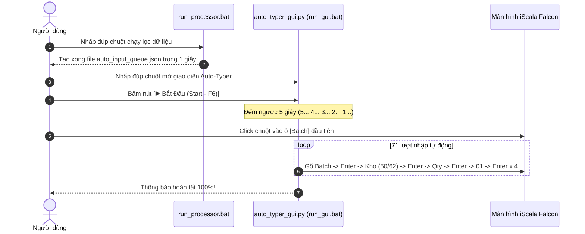

# Tổng Kết Bộ Công Cụ iScala Falcon Auto-Typer Suite

Bộ công cụ tự động hóa cấn trừ tồn kho âm trên máy chủ iScala (môi trường Falcon, không Excel, không quyền Admin) đã được xây dựng và đóng gói hoàn chỉnh.

---

## 1. Danh Mục Các Thành Phần Đã Tạo

| Thành phần / Tệp tin | Mô tả chi tiết |
| :--- | :--- |
| 📦 **`python_portable/`** | Thư mục Python 3.11.9 64-bit chính thức từ `python.org`, đầy đủ **chữ ký số hợp lệ của Python Software Foundation & Microsoft** (Đảm bảo an toàn 100% trước CrowdStrike Falcon EDR). Đã tích hợp sẵn Tkinter và thư viện Excel `openpyxl`. |
| ⚙️ **`batch_data_processor.py`** | **FILE 1**: Đọc `Stock Balance With Batch.xlsx`, lọc kho `50/62` âm, lấy tồn kho `61/01` dương theo đúng `Stock Code`, ưu tiên batch nhỏ nhất và bỏ qua nếu phải tách lẻ. |
| 🖥️ **`auto_typer_gui.py`** | **FILE 2**: Giao diện đồ họa Tkinter điều khiển Auto-Typer với nút Start (đếm ngược 5s), Pause/Resume, Stop, thanh trượt chỉnh tốc độ gõ (Speed Slider) và Live Streaming Console. |
| ▶️ **`run_processor.bat`** | File 1-Click để chạy lọc dữ liệu bằng Python Portable. |
| ▶️ **`run_gui.bat`** | File 1-Click để mở giao diện điều khiển Auto-Typer bằng Python Portable. |
| 📊 **`auto_input_queue.xlsx`** | Bảng Excel chi tiết 71 lượt nhập liệu đã được tạo sẵn. |
| 📑 **`report_unmatched_shortage.xlsx`** | Báo cáo chi tiết các mã vật tư còn thiếu hoặc cần tách lẻ. |
| 🗜️ **`iScala_Falcon_AutoTyper_Suite.zip`** | Toàn bộ gói ứng dụng đã được nén thành 1 file ZIP duy nhất (~33MB) để tải về máy chủ dễ dàng. |

---

## 2. Kết Quả Xử Lý Dữ Liệu Thực Tế

- **Tổng số dòng âm tại Kho 50 & 62**: **2.814 dòng** (Tổng số lượng âm: `382.450`).
- **Tổng số dòng dương khả dụng (Kho 61 & 01)**: **3.760 dòng** (Tổng tồn dương: `25.053.059`).
- **Số lượt nhập liệu nguyên vẹn (Không tách lẻ)**: **71 lượt**.
- **Số lượng âm được giải quyết ngay**: **109.173 đơn vị** (`28.55%`).
- **Thời gian Bot chạy xong 71 lượt**: **Khoảng 2 - 3 phút** (thay vì gõ tay mất cả buổi).

---

## 3. Quy Trình Vận Hành 3 Bước Đơn Giản

---

## 4. Hướng Dẫn Tải Về Máy Chủ

Anh có thể tải trực tiếp file zip nén trọn gói:
👉 **[iScala_Falcon_AutoTyper_Suite.zip](file:///workspaces/VBA/iScala_Falcon_AutoTyper_Suite.zip)**
Sau khi tải về, chỉ cần giải nén ra thư mục bất kỳ trên máy chủ và sử dụng ngay không cần cài đặt bất kỳ phần mềm nào khác.
